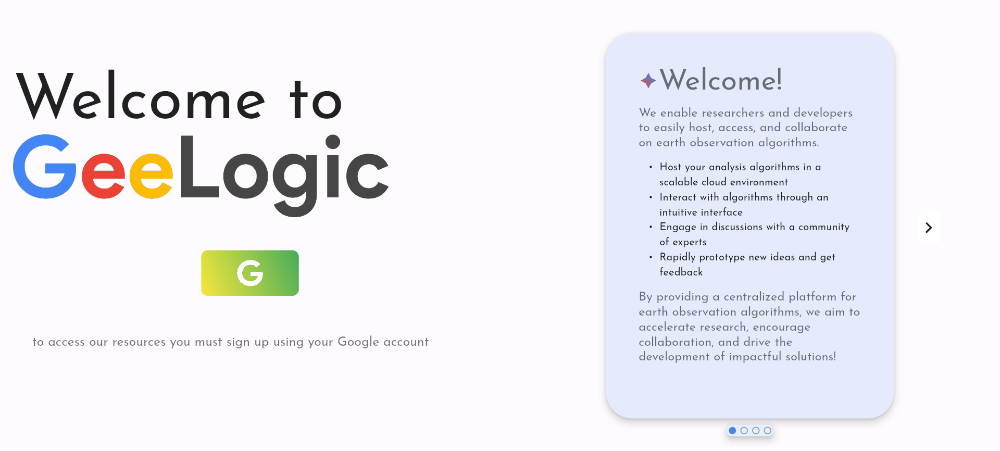
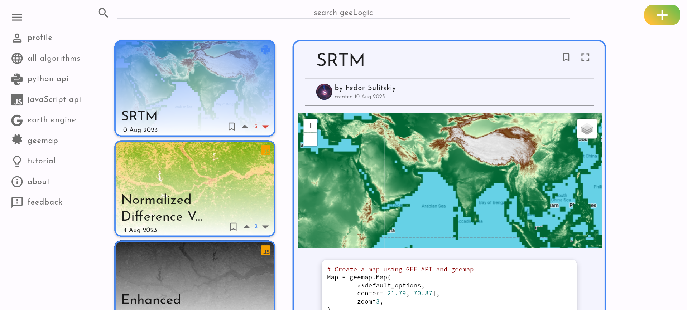
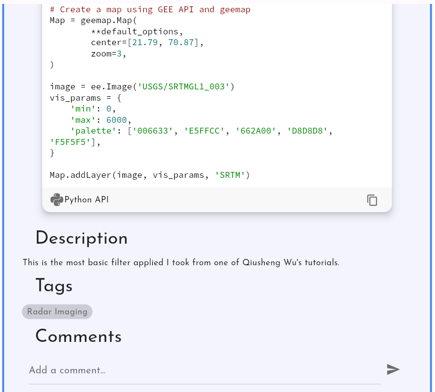
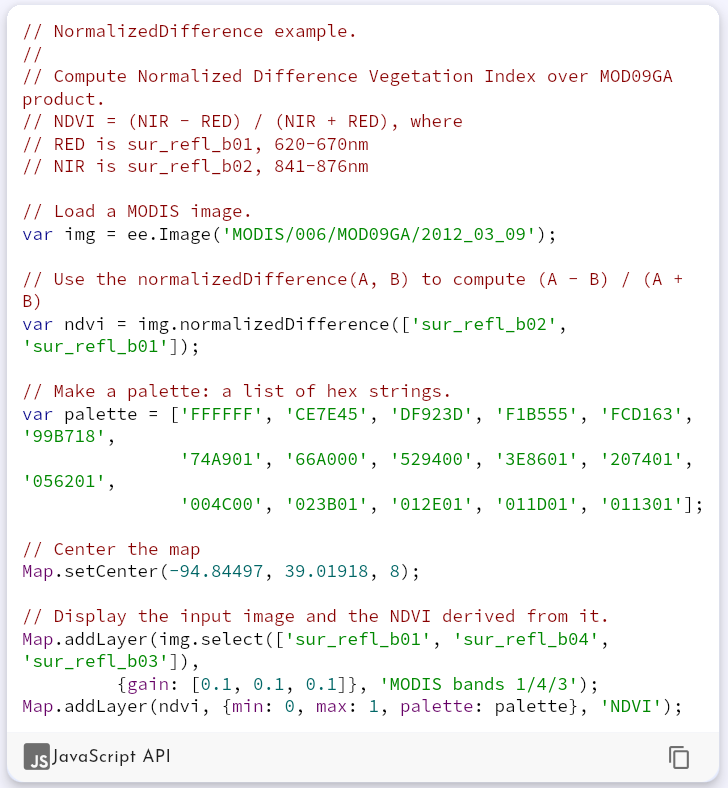
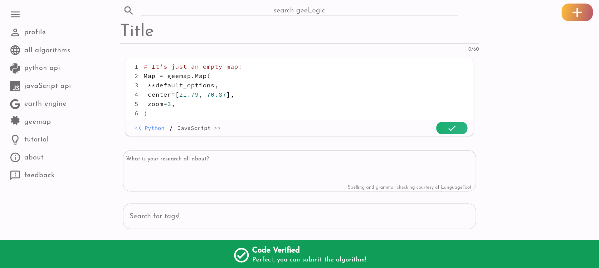
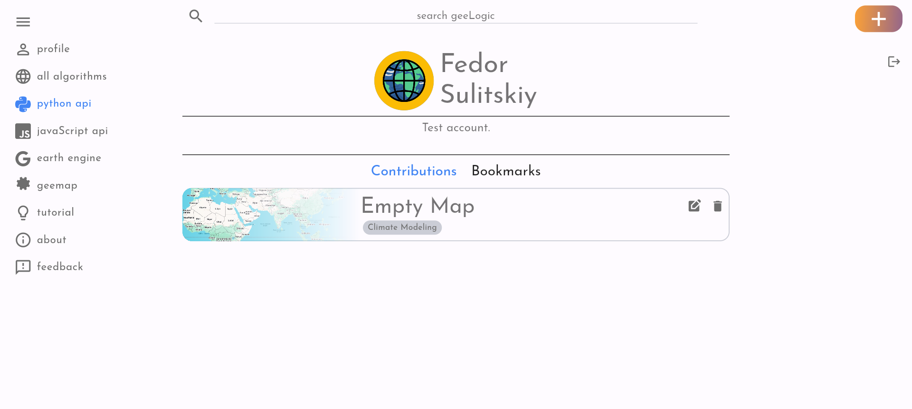
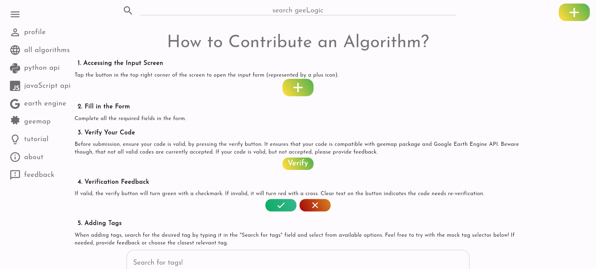
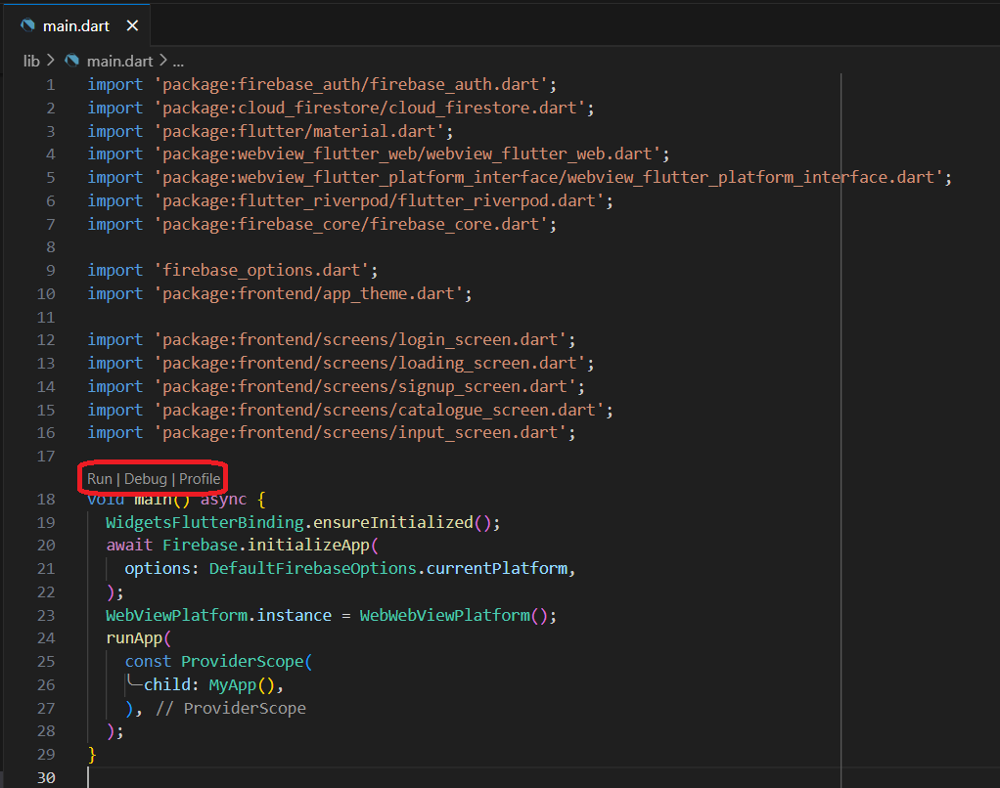
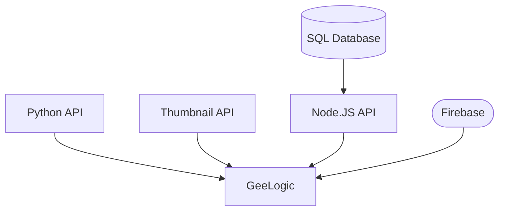

# 🌍 GeeLogic Project - _A Place for Earth Observers_

A social network for Earth Observation researchers to share and discuss their research algorithms. Designed to be interactive and immediately accessible!

## 📜 Table of Contents
- [❗ Why GeeLogic?](#-why-geelogic)
- [🌐 How can I access it?](#-how-can-i-access-it)
- [👷 How to contribute?](#-how-to-contribute)

## ❗ Why GeeLogic?

- Wouldn't it be **nice** to *immediately* recreate an algorithm from a study?
- Wouldn't it be **great** to have a *dynamic discussion* of a paper right after you read it?
- Wouldn't it be **valuable** to have a *community of professionals* focused on solutions to real world problems?

GeeLogic aims to create such a space. Where researchers, developer and entrepreneurs could share their insights and discuss solutions in the diverse and young field of Earth Observation! GeeLogic stands for Google Earth Engine Logic, since it is powered by the most popular Earth Imagery aggregator - Google Earth Engine.

## 🌐 How can I access it?

Head to [GeeLogic website](https://gee-gis-project-393016.firebaseapp.com/#/) and register! You will gain access to some of the existing Earth Observation filters taken from Google Earth Engine repository.

<p align="center">
  
</p>

After going throught the brief registration process, you will be redirected to the home screen with all the new algorithms submitted by users. Here you can explore new ideas and interact with the users' work.

<p align="center">
  
</p>

Each post has...

- a _title_, ...
- an _interactive map_ connected to **Google Earth Engine**, ...
- _code of the algorithm_ used to generate this map, ...
- a _description_, ...
- _tags_ for more helpful identification, ...
- and a _comment section_ for discussion!

<p align="center">
  
</p>

GeeLogic supports both JavaScript and Python API to render algorithms via **Google Earth Engine**. The Python API used is the **geemap** library. For convenience users can find links to both Google Earth Engine and geemap on the menu on the left.

<p align="center">
  
</p>

If users wants to contribute a new algorithm they can press the big PLUS button in the top right corner, fill in the form and submit their algorithm!

<p align="center">
  
</p>

And finally they can bookmark and review their submissions on the profile page.

<p align="center">
  
</p>

If at any point the user gets confused they can check out the tutorial section which will spell out how to contribute to GeeLogic!

<p align="center">
  
</p>

## 👷 How to Contribute?

To learn in depth on how GeeLogic is built and operates you can study my final report, found [here](https://github.com/fedorSulitskiy/GeeLogic/blob/main/_images/_report.docx). In my report you will be able to find the details on its front-end and back-end architectures as well as which services are used and why.

Clone the repository:

```bash
git clone https://github.com/fedorSulitskiy/GeeLogic.git
```

Run in debug mode from `lib/main.dart` file, with `Chrome (web-javascript)` as your environment.

<p align="center">
  
</p>

GeeLogic is a complex program with a diverse backend, whose components are the following:

- [Node.JS API](https://github.com/fedorSulitskiy/geelogic_node_api) => REST API Responsible for Data Submitted by the Users
- [Thumbnail API](https://github.com/fedorSulitskiy/geelogic_thumbnail_api) => REST API Responsible for generating thumbnail for each post
- Python API => REST API Responsible for getting the interactive map (_private due to sensitive information_)
- Firebase => Hosts GeeLogic and Stores sensitive user data


